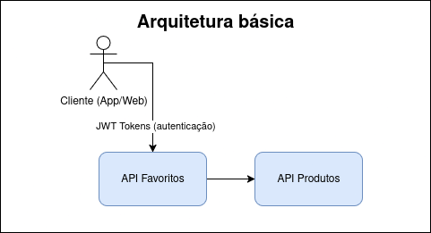
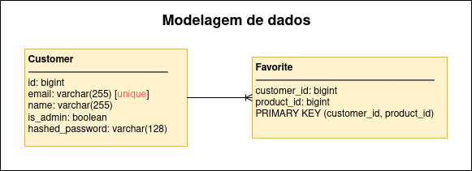

# aiqfav API
API to manage customers and their favorite products.

[Video about my decision in this API](https://drive.google.com/file/d/1dgPftQRKJ6TSB_YSO-ka0WzO3hG6Jo1P/view?usp=sharing)

> Not ready for production. To prepare for production, you would need to:
> - gitignore the `.env` file and add appropriate envs
> - add a production database
> - add a production Redis
> - add a production build stage to Docker file
> - build and push the Docker image to a registry
> - Add CORS middleware to the API
> - Improve observability (e.g. metrics, traces with OTEL, etc.)
> - Add throttling (rate limit requests)


## Dependencies

- Python 3.12
- Docker
- Docker Compose
- make
- uv
- pre-commit

## How to run

1. Install Docker and Docker Compose
2. Install `make` to run Makefile commands
3. Install `uv` (https://docs.astral.sh/uv/getting-started/installation/)
4. (Development only) Install `pre-commit` (https://pre-commit.com/) to run pre-commit hooks
5. Install project dependencies with `make install`
6. Run the project with `make dev` (this will build the project with Docker and run all containers in `docker-compose.yml`)
7. To view all available commands, run `make help`

### Alternative way to run the project
```bash
docker compose up -d --build
```

## Create an admin customer/user
Some endpoints require an admin customer. You can create one with the following command:
```bash
make create-admin
```

This will prompt you for the name, email and password of the admin customer.


## API Documentation
The API documentation is available at [http://localhost:8000/docs](http://localhost:8000/docs) (Swagger UI)
or [http://localhost:8000/redoc](http://localhost:8000/redoc) (ReDoc). **Powered by FastAPI**.

You can also get the OpenAPI specification file accessing [http://localhost:8000/openapi.json](http://localhost:8000/openapi.json).


## Tests
To run the tests, run `make test`.
To run the tests with coverage, run `make cov` The report will be available at `htmlcov/index.html`.


## Current coverage
Current coverage is `86%`.


## Postman collection
A Postman collection is available at `postman/aiqfav.postman_collection.json`.
You can import it into Postman to test the API.

You can also use [this invite link](https://app.getpostman.com/join-team?invite_code=5b3414e4715f76314c0b0e75967afe3705fb41be21b2da2481a9b90144537265&target_code=63f0fc0df654bb5d0ae9ca8fee5c236e) to access the collection.

In order to test, import the environment variables from `postman/aiqfav.postman_environment.json`,
and set the `base_url` to `http://localhost:8000`. Other envs will be set automatically on requests.


## Architecture




## DB diagram


